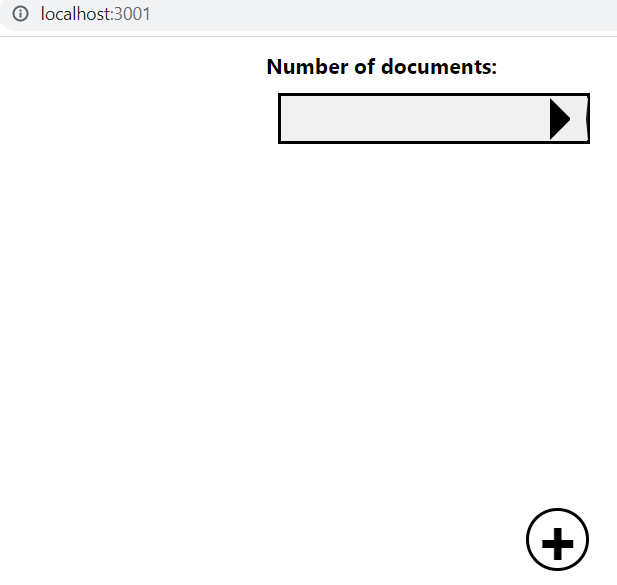

## install yarn
- `npm install --global yarn`
## initialise next js with 
-`yarn create next-app`
- had to change the username of the account, helped by `https://www.youtube.com/watch?v=w5N2aaiToiQ`
- change all the name in the environmental variables and then restarted

## move from react to nextjs with this `https://www.youtube.com/watch?v=tF1puEIZUP0`
- this youtube video didn't help much

## creating the below display

- the above display is made possible with the following contents
```
import styles from '../styles/Home.module.css'
import{Fragment} from 'react'
function HomePage(){
    return (<Fragment><div>
        <h1 className={styles.centering}>Number of documents:</h1>
        <div className={styles.foo}>
            <button className={styles.arrowRight}></button>
        </div>


    </div><div className={styles.bottomRight}>
            <button className={styles.circular}>+</button>
        </div></Fragment>)
}
export default HomePage
```
- the above content has been created as a part of `index.js` file which is under the folder `pages`
- The below css were added in the file named, `Home.modules.css` under the folder styles
```
.foo{
  position:fixed;
  left:40%;width:250px;border: 3px solid black;background-color: #f1f1f1;

}
.arrowRight {
  border-top: 16px solid transparent; /* border meaning is to draw a line, so we draw a line */
  border-bottom: 16px solid transparent;/*we draw a line here as well and this line has the same length as the line we draw above, which is 16px or 16*0.026=0.416cm*/
  
  border-left: 16px solid black; /* we draw a line here and this line has the same length as the line we draw above, which is 16px or 16*0.026=0.416cm. This line is for the left side */
    margin-left: 215px; /* margin left 217px means the div will be centered on the left side of the page. The page here refers to the div within which this is embedded. So 217px is the distance from the starting point */
}
.bottomRight{
  position:relative; /*relative means the div will be positioned relative to the page*/
}
.circular{
  position:fixed; /*relative means the div will be positioned relative to the page(page is the div in here)*/
        bottom:0%;
        right:30%;
        top:50%;
    
        width: 50px; /*width 100px means the div will be 100px wide*/
        height: 50px; /*height 100px means the div will be 100px high*/
        border-radius: 50%; /*border-radius 50% means the div will have a circular shape with a radius of 50% of the width of the div*/
        background-color: #fff; /*background-color #fff means the div will have a white background*/
        border: 3px solid #000; /*border 3px solid #000 means the div will have a black border with a width of 3px*/
        box-shadow: 0 0 0 0 rgba(0,0,0,0.2),0 0 0 0 rgba(0,0,0,0.19); /*box-shadow 0 0 0 0 rgba(0,0,0,0.2),0 0 0 0 rgba(0,0,0,0.19) means the div will have a shadow with a width of 0px, a height of 0px, a blur of 0px, a spread of 0px, a color of rgba(0,0,0,0.2), and a color of rgba(0,0,0,0.19)*/
        text-align: center; /*text-align center means the text will be centered*/
        line-height: 50px; /*line-height 100px means the text will be 100px high*/
        font-size: 50px; /*font-size 50px means the text will be 50px high*/
        color: #000; /*color #000 means the text will be black*/
        font-weight: bold; /*font-weight bold means the text will be bold*/
        font-family: 'Arial'; /*font-family 'Arial' means the text will be in Arial font*/
        
    
}
```
- Now, in the `index.js`, we see the `Fragment`
- The `fragment` is used to wrap the `component` in a `single element`.
- Now, what is a component? A component is a function that returns some html.
- In our case, the HomePage function returns some html.
- The HomePage function is a component in our case.
- The fragment is used to wrap the component, in our case, the HomePage function, in a single element.
- If we would have not used the fragment, the HomePage function would have not been wrapped in a single element.
- The reason it is important to wrap the component in a single element is because client side rendering is done using the virtual DOM.
- client side rendering meaning that the browser renders the application on the screen.
- rendering means to display the application on the screen.
- <a href="https://katiehyenychoi.medium.com/virtual-dom-vs-real-dom-44d442eb2501" target="_blank">difference between vdom & dom</a> 
- A view of the virtual DOM consists of a tree of nodes.
- The tree of nodes is a representation of the application that is used by the browser to render the application on the screen.
- The nodes of this tree are as follows:
1. The root node is the document node. The document node contains the head node and the body node.
2. The head node contains the title node.
3. The body node contains the div node.
4. The div node contains the h1 node.
5. The h1 node contains the text node.
6. The text node contains the text "Number of documents:".
- Coming back, <a href="https://stackoverflow.com/questions/54665999/why-return-multiple-elements-in-react-is-not-allowed">When you return multiple elements from React elements from the render method, the assumtion that the tree will have one root node for the Component will not longer hold, hence making it difficult to process reconcilation algorithm.</a>
## `DocumentPage.js`<- This was the initial name and later it was changed to a dynamic file named `[doc_ID].js`
- The reason is the below photo
- According to the photo, it demands the next page to be dynamic

- The below is the code for `DocumentPage.js`
```
function DocumentPage(){

    return <h1>Document 1</h1>
}
export default DocumentPage
```
- In the above, it is just a static look
- if we would have done `http://localhost:3000/DocumentPage`, then we would have seen the obvious content
- Now, we will attempt to make this page dynamic
- we renamed from `DocumentPage.js` to `[doc_ID].js`
- This tells nextJS that it is a dynamic page
- to check the dynamicity we did, `http://localhost:3000/aninda` and we got the same view as `http://localhost:3000/DocumentPage`
- we tried again with `http://localhost:3000/arunava` and the same result
- Now, if we want to see what has been passed by the user within the browser, we open the `developer option`
- In order to proceed, let's change the code a bit by introducing the changes as below
- `import{useRouter} from 'next/router'`
- `const router=useRouter()`
- `console.log(router.query.doc_ID)`

```
import{useRouter} from 'next/router'
function DocumentPage(){

    const router=useRouter()
    console.log(router.query.doc_ID) 
    return <h1>Document 1</h1>
}
export default DocumentPage
```
- <a href="https://www.youtube.com/watch?v=BYbgopx44vo&feature=emb_imp_woyt
">let's recollect the usage of vdom with the robot and human named view story</a>


